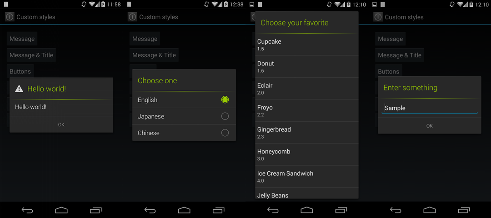
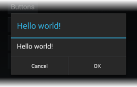
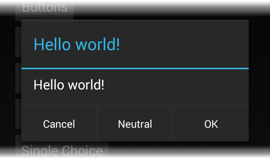
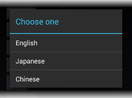
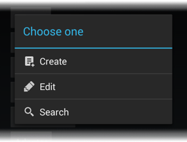
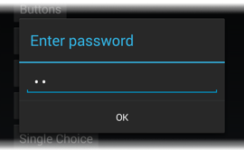

SimpleAlertDialog for Android
===

[](https://travis-ci.org/ksoichiro/SimpleAlertDialog-for-Android)
[](https://coveralls.io/r/ksoichiro/SimpleAlertDialog-for-Android?branch=master)
[](https://github.com/ksoichiro/SimpleAlertDialog-for-Android/releases/latest)

SimpleAlertDialog is a library for using `DialogFragment` like `AlertDialog` in the Android application.  

[View in Japanese](README.ja.md)




## Features

* Available from API level 4 (Android 1.6 Donut) to 19 (Android 4.4 KitKat) and L.
* Holo style for all versions.
* Simple interface like `AlertDialog.Builder`.
* Convenient callbacks are provided to handle basic events.
* Dialog's lifecycle is synchronized with parent activity or fragment, which will suppress `IllegalStateException`.
* Supports both the `Activity` on API level 11+ and the `FragmentActivity` in the android-support-v4 library.

## Installation

### Gradle

```groovy
dependencies {
    compile 'com.github.ksoichiro:simplealertdialog:1.2.0@aar'
}
```

### Eclipse ADT (Import as a library project)

The 'simplealertdialog' folder is the main library.
Please import it into the Eclipse, Android Studio or other IDEs.

## Usage

### Message and a button


If you want to show just a message and OK button:

```java
new SimpleAlertDialogFragment.Builder()
        .setMessage("Hello world!")
        .setPositiveButton(android.R.string.ok)
        .create().show(getFragmentManager(), "dialog");
```

### Handling button click



If you want to handle button click event, build dialog like this:

```java
new SimpleAlertDialogFragment.Builder()
        .setMessage("Hello world!")
        .setPositiveButton(android.R.string.ok)
        .setNegativeButton(android.R.string.cancel)
        .setRequestCode(1)
        .create().show(getFragmentManager(), "dialog");
```

Make the activity to implement `SimpleAlertDialog.OnClickListener`:

```java
public class NormalActivity extends Activity
        implements SimpleAlertDialog.OnClickListener
```

Then write handlers:

```java
@Override
public void onDialogPositiveButtonClicked(SimpleAlertDialog dialog,
        int requestCode, View view) {
    if (requestCode == 1) {
        Toast.makeText(this, "OK button clicked", Toast.LENGTH_SHORT).show();
    }
}

@Override
public void onDialogNegativeButtonClicked(SimpleAlertDialog dialog,
        int requestCode, View view) {
    if (requestCode == 1) {
        Toast.makeText(this, "Cancel button clicked", Toast.LENGTH_SHORT).show();
    }
}
```

Don't forget to set the request code.  
If you handle multiple dialogs in an `Actvity` or `Fragment`, those dialogs call the same event handlers, so the request code is necessery to distinguish them.

### Neutral button



Like `AlertDialog.Builder`, you can use a neutral button like this:

```java
new SimpleAlertDialogFragment.Builder()
        .setMessage("Hello world!")
        .setPositiveButton(android.R.string.ok)
        .setNeutralButton(R.string.neutral)
        .setNegativeButton(android.R.string.cancel)
        .setRequestCode(1)
        .create().show(getFragmentManager(), "dialog");
```

To handle neutral button taps, implement `SimpleAlertDialog.OnNeutralButtonClickListener` interface in addition to `SimpleAlertDialog.OnClickListener`.

```java
public class NormalActivity extends Activity
        implements SimpleAlertDialog.OnNeutralButtonClickListener
```

The implement callback.

```java
@Override
public void onDialogNeutralButtonClicked(SimpleAlertDialog dialog, int requestCode, View view) {
    if (requestCode == 1) {
        Toast.makeText(this, "Neutral button clicked", Toast.LENGTH_SHORT).show();
    }
}
```

### String items



You can use the string items style dialog.

Create dialog:

```java
new SimpleAlertDialogFragment.Builder()
        .setTitle("Choose one")
        .setItems(R.array.single_choice)
        .setRequestCode(REQUEST_CODE_ITEMS)
        .create().show(getFragmentManager(), "dialog");
```

Implement the interface:

```java
implements SimpleAlertDialog.OnItemClickListener
```

Implement callbacks:

```java
@Override
public void onOnItemClick(final SimpleAlertDialog dialog, int requestCode,
        int which) {
    if (requestCode == REQUEST_CODE_ITEMS) {
        // Do something
    }
}
```

### String items with icons



To show string items with icons, create dialog like this:

```java
new SimpleAlertDialogFragment.Builder()
        .setTitle("Choose one")
        .setItems(R.array.icon_items, new int[]{
                R.drawable.ic_action_aci_document3,
                R.drawable.ic_action_aci_edit,
                R.drawable.ic_action_aci_search})
        .setRequestCode(REQUEST_CODE_ICON_ITEMS)
        .create().show(getFragmentManager(), "dialog");
```

To handle list item taps, use `SimpleAlertDialog.OnItemClickListener` just like string items.

### Single choice list


You can use the single choice list style dialog.

Create dialog:

```java
new SimpleAlertDialogFragment.Builder()
        .setTitle("Choose one")
        .setSingleChoiceCheckedItem(0) // This enables a single choice list
        .setRequestCode(REQUEST_CODE_SINGLE_CHOICE_LIST)
        .create().show(getFragmentManager(), "dialog");
```

Implement the interface:

```java
implements SimpleAlertDialog.SingleChoiceArrayItemProvider
```

Implement callbacks:

```java
@Override
public CharSequence[] onCreateSingleChoiceArray(final SimpleAlertDialog dialog, int requestCode) {
    if (requestCode == REQUEST_CODE_SINGLE_CHOICE_LIST) {
        return getResources().getTextArray(R.array.single_choice);
    }
    return null;
}

@Override
public void onSingleChoiceArrayItemClick(final SimpleAlertDialog dialog, int requestCode,
        int position) {
    if (requestCode == REQUEST_CODE_SINGLE_CHOICE_LIST) {
        // Do something
    }
}
```

### Custom adapter


You can use your custom `ListAdapter` in the dialog.

Create dialog:

```java
new SimpleAlertDialogFragment.Builder()
        .setTitle("Choose your favorite")
        .setUseAdapter(true) // This enables a custom adapter
        .setRequestCode(REQUEST_CODE_ADAPTER)
        .create().show(getFragmentManager(), "dialog");
```

Implement the interface:

```java
implements SimpleAlertDialog.ListProvider
```

Implement callbacks:

```java
@Override
public ListAdapter onCreateList(SimpleAlertDialog dialog, int requestCode) {
    if (requestCode == REQUEST_CODE_ADAPTER) {
        // Create your custom adapter
        return new SweetsAdapter(this, SWEETS_LIST);
    }
    return null;
}

@Override
public void onListItemClick(SimpleAlertDialog dialog, int requestCode, int position) {
    if (requestCode == REQUEST_CODE_ADAPTER) {
        // Do something
    }
}
```

### Custom view


You can use your custom view in the dialog.

Create dialog:

```java
new SimpleAlertDialogFragment.Builder()
        .setTitle("Enter something")
        .setUseView(true) // This enables a custom view
        .setRequestCode(REQUEST_CODE_VIEW)
        .create().show(getFragmentManager(), "dialog");
```

Implement the interface:

```java
implements SimpleAlertDialog.ViewProvider
```

Implement callbacks:

```java
@Override
public View onCreateView(SimpleAlertDialog dialog, int requestCode) {
    if (requestCode == REQUEST_CODE_VIEW) {
        final View view = LayoutInflater.from(this).inflate(R.layout.view_editor, null);
        ((EditText) view.findViewById(R.id.text)).setText("Sample");
        return view;
    }
    return null;
}
```

### EditText



If you want to use a view with an `EditText`, you don't have to create layout files: just call `setEditText()` on `Builder`.

```java
new SimpleAlertDialogFragment.Builder()
        .setTitle("Enter something")
        .setEditText("Sample", InputType.TYPE_CLASS_TEXT)
        .setRequestCode(REQUEST_CODE_EDIT_TEXT)
        .create().show(getFragmentManager(), "dialog");
```

## Customizing styles

You can customize each part of the dialog.  
Define `simpleAlertDialogStyle` in your theme:

```xml
<style name="CustomTheme" parent="CustomBaseTheme">
    <item name="simpleAlertDialogStyle">@style/SimpleAlertDialogStyle</item>
</style>
```

This style can be constructed like this:

```xml
<style name="SimpleAlertDialogStyle" parent="@style/Theme.SimpleAlertDialog">
    <!-- Title separator styles -->
    <item name="sadTitleSeparatorBackground">@drawable/title_separator</item>
    <item name="sadTitleSeparatorHeight">1dp</item>
    <!-- TextView style of the title -->
    <item name="sadTitleTextStyle">@style/SimpleAlertDialogTitleTextStyle</item>
    <!-- TextView style of the message -->
    <item name="sadMessageTextStyle">@style/SimpleAlertDialogMessageTextStyle</item>
    <!-- TextView style of the OK / Cancel buttons -->
    <item name="sadButtonTextStyle">@style/SimpleAlertDialogButtonTextStyle</item>
    <!-- TextView in the Single choise list item -->
    <item name="sadListItemTextStyle">@style/SimpleAlertDialogListItemTextStyle</item>
    <!-- Drawable for radio button of the single choice list item -->
    <item name="sadListChoiceIndicatorSingle">@drawable/simpleblue_btn_radio</item>
</style>
```

Styles in the `xxxTextStyle` will be used as `TextAppearance`.  
So you can customize their styles as if they were just a `TextView`.

```xml
<style name="SimpleAlertDialogTitleTextStyle">
    <item name="android:textColor">#FF99CC00</item>
    <item name="android:fontFamily">sans-serif-light</item>
</style>
```

If you want to use styles based on Holo Light, set replace the `parent` attribute to `@style/Theme.SimpleAlertDialog.Light`:

```xml
<style name="SimpleAlertDialogStyle" parent="@style/Theme.SimpleAlertDialog.Light">
```


## Customizing theme (window animation)

First of all, define your style.  
Put some codes like following to your `res/values/styles.xml`:

```xml
    <style name="SimpleAlertDialogCustomTheme" parent="android:Theme.Dialog">
        <item name="android:windowAnimationStyle">@style/SimpleAlertDialogCustomAnimation</item>
    </style>

    <style name="SimpleAlertDialogCustomAnimation" parent="android:Animation.Dialog">
        <item name="android:windowEnterAnimation">@anim/fade_in</item>
        <item name="android:windowExitAnimation">@anim/fade_out</item>
    </style>
```

Then apply it to your dialog:

```java
findViewById(R.id.btn_themed).setOnClickListener(new View.OnClickListener() {
    @Override
    public void onClick(final View v) {
        new SimpleAlertDialogSupportFragment.Builder()
                .setTheme(R.style.SimpleAlertDialogCustomTheme)
                .setMessage("Hello world!")
                .setPositiveButton(android.R.string.ok)
                .create().show(getSupportFragmentManager(), "dialog");
    }
});
```

You can see window entering/exiting animation defined by `@anim/fade_in` and `@anim/fade_out`.

## Further more detailed usage and about design

### Use in Fragment

SimpleAlertDialog accesses to its parent fragment by using `getTargetFragment()`.  
So you can interact with Fragment by calling `setTargetFragment()`
when building SimpleAlertDialog.

```java
        new SimpleAlertDialogSupportFragment.Builder()
            // This enables SimpleAlertDialog to recognize that
            // MyFragment is its caller.
            .setTargetFragment(MyFragment.this)
            :
```

### Why do I have to implement interfaces for callbacks and passing parameters?

SimpleAlertDialog is just a kind of `DialogFragment`, so it must follow the manner of using `Fragment` or `DialogFragment`.  
`DialogFragment` has its own lifecycle and it's not the same as the `Activity`'s one.

So if you pass your custom view, callback, etc. directly, it may cause your app crash because `Activity` and `Fragment` are reproduced according to their own life cycles, which will result in invalid references(`NullPointerExeption` or something like that) or will make some parameters passed by `Builder` `null`.

To handle this issue, `Fragment`s(`DialogFragment`s) must not have instance fields and can be recreated with no args constructor and all the parameters for Fragment's should be handled with `Bundle` object.  

In consideration of all of these things, I concluded that it is the best solution that SimpleAlertDialog assumes objects got by `getActivity()` and `getTargetFragment()` as its callbacks candidates and if they implement some specific interfaces they must be called back.  
This solution does not depend on references, so it's safe in terms of life cycles problems.

Therefore, I've adopted a method of using interfaces.

## Samples

* Sample applications using this library are included in the simplealertdialog-samples folder.
* You can also try it on Google Play.

  [](https://play.google.com/store/apps/details?id=com.simplealertdialog.sample.demos)


## Developed By

* Soichiro Kashima - <soichiro.kashima@gmail.com>


## License

    Copyright 2014 Soichiro Kashima

    Licensed under the Apache License, Version 2.0 (the "License");
    you may not use this file except in compliance with the License.
    You may obtain a copy of the License at

        http://www.apache.org/licenses/LICENSE-2.0

    Unless required by applicable law or agreed to in writing, software
    distributed under the License is distributed on an "AS IS" BASIS,
    WITHOUT WARRANTIES OR CONDITIONS OF ANY KIND, either express or implied.
    See the License for the specific language governing permissions and
    limitations under the License.

Part of the drawables are from Android Open Source Project.

    Copyright (C) 2010 The Android Open Source Project

    Licensed under the Apache License, Version 2.0 (the "License");
    you may not use this file except in compliance with the License.
    You may obtain a copy of the License at

        http://www.apache.org/licenses/LICENSE-2.0

    Unless required by applicable law or agreed to in writing, software
    distributed under the License is distributed on an "AS IS" BASIS,
    WITHOUT WARRANTIES OR CONDITIONS OF ANY KIND, either express or implied.
    See the License for the specific language governing permissions and
    limitations under the License.

This library uses [chrisbanes/gradle-mvn-push](https://github.com/chrisbanes/gradle-mvn-push) for releasing.

    Copyright 2013 Chris Banes

    Licensed under the Apache License, Version 2.0 (the "License");
    you may not use this file except in compliance with the License.
    You may obtain a copy of the License at

        http://www.apache.org/licenses/LICENSE-2.0

    Unless required by applicable law or agreed to in writing, software
    distributed under the License is distributed on an "AS IS" BASIS,
    WITHOUT WARRANTIES OR CONDITIONS OF ANY KIND, either express or implied.
    See the License for the specific language governing permissions and
    limitations under the License.
