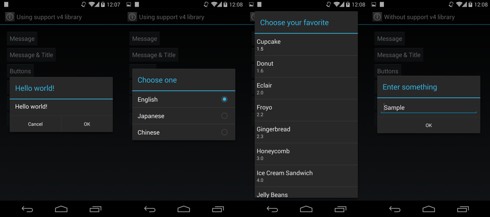
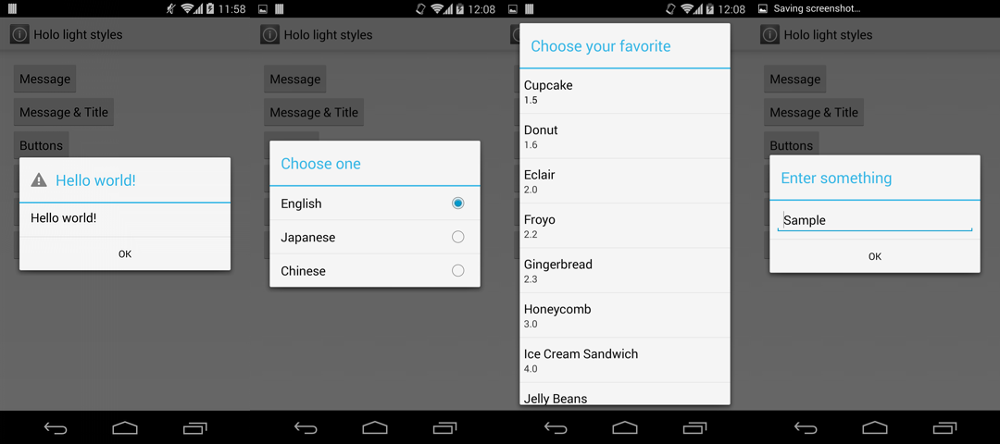
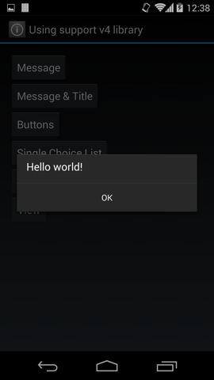
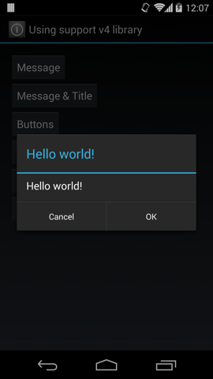
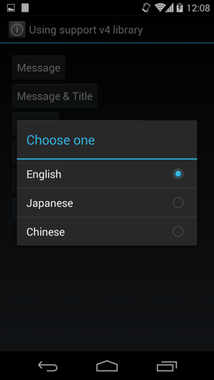

[](https://travis-ci.org/ksoichiro/SimpleAlertDialog-for-Android)

SimpleAlertDialog for Android
===

SimpleAlertDialog is a library for using `DialogFragment` like `AlertDialog` in the Android application.  





## Features

* Available from API level 4 (Android 1.6 Donut) to 19 (Android 4.4 KitKat).
* Holo style for all versions.
* Simple interface like `AlertDialog.Builder`.
* Convenient callbacks are provided to handle basic events.
* Dialog's lifecycle is synchronized with parent activity or fragment, which will suppress `IllegalStateException`.
* Supports both the `Activity` on API level 11+ and the `FragmentActivity` in the android-support-v4 library.

## Usage

### Message and a button



If you want to show just a message and OK button:

```java
new SimpleAlertDialogFragment.Builder()
        .setMessage("Hello world!")
        .setPositiveButton(android.R.string.ok)
        .create().show(getFragmentManager(), "dialog");
```

### Handling button click



If you want to handle button click event, build dialog like this:

```java
new SimpleAlertDialogFragment.Builder()
        .setMessage("Hello world!")
        .setPositiveButton(android.R.string.ok)
        .setNegativeButton(android.R.string.cancel)
        .setRequestCode(1)
        .create().show(getFragmentManager(), "dialog");
```

Make the activity to implement `SimpleAlertDialog.OnClickListener`:

```java
public class NormalActivity extends Activity
        implements SimpleAlertDialog.OnClickListener
```

Then write handlers:

```java
@Override
public void onDialogPositiveButtonClicked(SimpleAlertDialog dialog,
        int requestCode, View view) {
    if (requestCode == 1) {
        Toast.makeText(this, "OK button clicked", Toast.LENGTH_SHORT).show();
    }
}

@Override
public void onDialogNegativeButtonClicked(SimpleAlertDialog dialog,
        int requestCode, View view) {
    if (requestCode == 1) {
        Toast.makeText(this, "Cancel button clicked", Toast.LENGTH_SHORT).show();
    }
}
```

Don't forget to set the request code.  
If you handle multiple dialogs in an `Actvity` or `Fragment`, those dialogs call the same event handlers, so the request code is necessery to distinguish them.

### Single choice list



You can use the single choice list style dialog.

Create dialog:

```java
new SimpleAlertDialogFragment.Builder()
        .setTitle("Choose one")
        .setSingleChoiceCheckedItem(0) // This enables a single choice list
        .setRequestCode(REQUEST_CODE_SINGLE_CHOICE_LIST)
        .create().show(getFragmentManager(), "dialog");
```

Implement the interface:

```java
implements SimpleAlertDialog.SingleChoiceArrayItemProvider
```

Implement callbacks:

```java
@Override
public CharSequence[] onCreateSingleChoiceArray(final SimpleAlertDialog dialog, int requestCode) {
    if (requestCode == REQUEST_CODE_SINGLE_CHOICE_LIST) {
        return getResources().getTextArray(R.array.single_choice);
    }
    return null;
}

@Override
public void onSingleChoiceArrayItemClick(final SimpleAlertDialog dialog, int requestCode,
        int position) {
    if (requestCode == REQUEST_CODE_SINGLE_CHOICE_LIST) {
        // Do something
    }
}
```

### Custom adapter


You can use your custom `ListAdapter` in the dialog.

Create dialog:

```java
new SimpleAlertDialogFragment.Builder()
        .setTitle("Choose your favorite")
        .setUseAdapter(true) // This enables a custom adapter
        .setRequestCode(REQUEST_CODE_ADAPTER)
        .create().show(getFragmentManager(), "dialog");
```

Implement the interface:

```java
implements SimpleAlertDialog.ListProvider
```

Implement callbacks:

```java
@Override
public ListAdapter onCreateList(SimpleAlertDialog dialog, int requestCode) {
    if (requestCode == REQUEST_CODE_ADAPTER) {
        // Create your custom adapter
        return new SweetsAdapter(this, SWEETS_LIST);
    }
    return null;
}

@Override
public void onListItemClick(SimpleAlertDialog dialog, int requestCode, int position) {
    if (requestCode == REQUEST_CODE_ADAPTER) {
        // Do something
    }
}
```

### Custom view


You can use your custom view in the dialog.

Create dialog:

```java
new SimpleAlertDialogFragment.Builder()
        .setTitle("Enter something")
        .setUseView(true) // This enables a custom view
        .setRequestCode(REQUEST_CODE_VIEW)
        .create().show(getFragmentManager(), "dialog");
```

Implement the interface:

```java
implements SimpleAlertDialog.ViewProvider
```

Implement callbacks:

```java
@Override
public View onCreateView(SimpleAlertDialog dialog, int requestCode) {
    if (requestCode == REQUEST_CODE_VIEW) {
        final View view = LayoutInflater.from(this).inflate(R.layout.view_editor, null);
        ((EditText) view.findViewById(R.id.text)).setText("Sample");
        return view;
    }
    return null;
}
```

## Customizing styles

You can customize each part of the dialog.  
Define `simpleAlertDialogStyle` in your theme:

```xml
<style name="CustomTheme" parent="CustomBaseTheme">
    <item name="simpleAlertDialogStyle">@style/SimpleAlertDialogStyle</item>
</style>
```

This style can be constructed like this:

```xml
<style name="SimpleAlertDialogStyle" parent="@style/Theme.SimpleAlertDialog">
    <!-- Title separator styles -->
    <item name="sadTitleSeparatorBackground">@drawable/title_separator</item>
    <item name="sadTitleSeparatorHeight">1dp</item>
    <!-- TextView style of the title -->
    <item name="sadTitleTextStyle">@style/SimpleAlertDialogTitleTextStyle</item>
    <!-- TextView style of the message -->
    <item name="sadMessageTextStyle">@style/SimpleAlertDialogMessageTextStyle</item>
    <!-- TextView style of the OK / Cancel buttons -->
    <item name="sadButtonTextStyle">@style/SimpleAlertDialogButtonTextStyle</item>
    <!-- TextView in the Single choise list item -->
    <item name="sadListItemTextStyle">@style/SimpleAlertDialogListItemTextStyle</item>
    <!-- Drawable for radio button of the single choice list item -->
    <item name="sadListChoiceIndicatorSingle">@drawable/simpleblue_btn_radio</item>
</style>
```

Styles in the `xxxTextStyle` will be used as `TextAppearance`.  
So you can customize their styles as if they were just a `TextView`.

```xml
<style name="SimpleAlertDialogTitleTextStyle">
    <item name="android:textColor">#FF99CC00</item>
    <item name="android:fontFamily">sans-serif-light</item>
</style>
```

If you want to use styles based on Holo Light, set replace the `parent` attribute to `@style/Theme.SimpleAlertDialog.Light`:

```xml
<style name="SimpleAlertDialogStyle" parent="@style/Theme.SimpleAlertDialog.Light">
```


## Samples

* Sample applications using this library are included in the samples folder.
* You can also try it on Google Play.

  [](https://play.google.com/store/apps/details?id=com.simplealertdialog.sample.demos)


## Developed By

* Soichiro Kashima - <soichiro.kashima@gmail.com>


## License

    Copyright 2014 Soichiro Kashima

    Licensed under the Apache License, Version 2.0 (the "License");
    you may not use this file except in compliance with the License.
    You may obtain a copy of the License at

        http://www.apache.org/licenses/LICENSE-2.0

    Unless required by applicable law or agreed to in writing, software
    distributed under the License is distributed on an "AS IS" BASIS,
    WITHOUT WARRANTIES OR CONDITIONS OF ANY KIND, either express or implied.
    See the License for the specific language governing permissions and
    limitations under the License.

